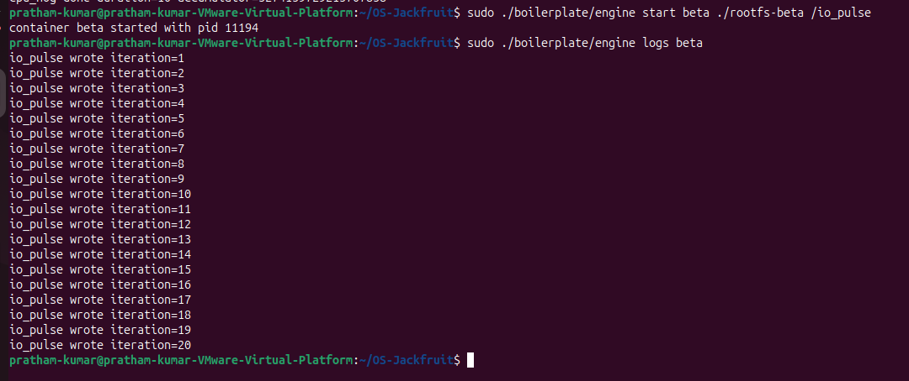

# OS Jackfruit Mini Project  
## User-Space Container Runtime with Kernel-Space Memory Monitoring

---

## 1. Team Information

**Team Member 1:** Pratham Kumar  
**SRN:** PES2UG24CS368  

**Team Member 2:** Karthik P  
**SRN:** PES2UG24CS348  

**Course:** UE24CS242B - Operating Systems  
**Institute:** PES University  
**Project Title:** OS Jackfruit Mini Project  

---

## 2. Project Overview

This project implements a lightweight container runtime in C along with a Linux kernel module for memory monitoring and enforcement. The goal is to build a simplified container system that demonstrates core operating system concepts such as process isolation, namespaces, parent-child supervision, IPC, synchronization, logging pipelines, kernel-user communication, process scheduling, and memory enforcement.

The project is divided into two major parts:

1. **User-space runtime (`engine.c`)**
   - Starts and maintains a long-running supervisor process
   - Accepts CLI commands such as `supervisor`, `start`, `run`, `ps`, `logs`, and `stop`
   - Launches containers using Linux namespaces
   - Tracks container metadata
   - Captures container output through a logging pipeline
   - Communicates with the kernel module through `ioctl`

2. **Kernel-space memory monitor (`monitor.c`)**
   - Creates the device `/dev/container_monitor`
   - Accepts monitoring requests from user space
   - Tracks registered container processes
   - Checks resident memory periodically
   - Produces soft-limit warnings
   - Enforces hard limits by killing offending processes

This project is intentionally close to real OS mechanisms. The containers are not virtual machines. They still share the same host kernel, but they are isolated in terms of PID view, hostname, and mount view using namespaces.

---

## 3. Objectives

The main objectives of this project are:

- To implement a multi-container runtime supervised by one parent process
- To isolate containers using Linux namespaces and separate root filesystems
- To provide CLI-based management of containers
- To implement bounded-buffer-based logging
- To build a kernel module that monitors and enforces memory usage
- To demonstrate scheduling behavior using different workloads
- To connect implementation details with fundamental OS concepts

---

## 4. Repository Structure

```text
OS-Jackfruit/
├── boilerplate/
│   ├── engine.c
│   ├── monitor.c
│   ├── monitor_ioctl.h
│   ├── Makefile
│   ├── cpu_hog.c
│   ├── memory_hog.c
│   ├── io_pulse.c
│   └── environment-check.sh
├── screenshots/
│   ├── Screenshots_1_build_success.png
│   ├── Screenshots_2_rootfs_setup.png
│   ├── Screenshots_3_kernel_module.png
│   ├── Screenshots_4_supervisor_ready.png
│   ├── Screenshots_5_cpu_hog.png
│   ├── Screenshots_6_io_pulse.png
│   ├── Screenshots_7_memory_hog.png
│   └── Screenshots_8_control_run.png
├── docs/
│   └── <report file will be added here>
├── README.md
├── project-guide.md
└── .gitignore
```

---

## 5. Environment Setup from Scratch

This section explains the setup from the beginning, starting from a clean Ubuntu VM.


### 5.1 Recommended environment

- Ubuntu 22.04 or 24.04 VM
- VMware Workstation / VirtualBox
- Internet connection
- Kernel headers matching the running kernel
- Sudo access


### 5.2 Update package list

```bash
sudo apt update
```


### 5.3 Install required packages

```bash
sudo apt install -y build-essential linux-headers-$(uname -r) wget
```

These packages are needed because:

- build-essential provides gcc, make, and standard build tools
- linux-headers-$(uname -r) is required to compile the kernel module
- wget is used to download the Alpine mini root filesystem


### 5.4 Clone your forked repository

```bash
git clone https://github.com/<your-username>/OS-Jackfruit.git
cd OS-Jackfruit
```

---

## 6. Root Filesystem Preparation

Each container needs its own writable root filesystem. We first create a base Alpine rootfs and then copy it per container.

### 6.1 Download Alpine minirootfs

```bash
wget https://dl-cdn.alpinelinux.org/alpine/v3.20/releases/x86_64/alpine-minirootfs-3.20.3-x86_64.tar.gz
```

### 6.2 Create base rootfs
```bash
mkdir rootfs-base
tar -xzf alpine-minirootfs-3.20.3-x86_64.tar.gz -C rootfs-base
```

### 6.3 Create per-container copies

```bash
cp -a rootfs-base rootfs-alpha
cp -a rootfs-base rootfs-beta
cp -a rootfs-base rootfs-gamma
```

### 6.4 Copy workloads into the respective root filesystems

```bash
cp boilerplate/cpu_hog rootfs-alpha/
cp boilerplate/io_pulse rootfs-beta/
cp boilerplate/memory_hog rootfs-gamma/
```

### 6.5 Verify rootfs contents

```bash
ls rootfs-base
ls rootfs-alpha | grep cpu_hog
ls rootfs-beta | grep io_pulse
ls rootfs-gamma | grep memory_hog
```

The important point is that a command like /cpu_hog runs inside the container root, so the binary must actually exist in that container’s rootfs.

---

## 7. Build Instructions

The project is built from inside the boilerplate/ directory.

### 7.1 Clean previous outputs

```bash
cd ~/OS-Jackfruit/boilerplate
make clean
```

### 7.2 Build everything

```bash
make
```

### 7.3 Expected outputs

The build should generate:

- engine
- monitor.ko
- cpu_hog
- memory_hog
- io_pulse

### 7.4 CI-safe build path

The repository also keeps the required CI-safe user-space build path:

```bash
make -C boilerplate ci
```

This is kept so that the inherited GitHub smoke check can compile the user-space side even on environments where kernel module loading is not possible.

---

## 8. Load, Verify, and Unload the Kernel Module

### 8.1 Load the module

```bash
cd ~/OS-Jackfruit/boilerplate
sudo insmod monitor.ko
```

### 8.2 Verify module presence
```bash
lsmod | grep monitor
```

### 8.3 Verify control device
```bash
ls -l /dev/container_monitor
```

Expected result:

```bash
/dev/container_monitor
```

### 8.4 Optional kernel log check

```bash
sudo dmesg | tail -n 20
```

### 8.5 Unload module after finishing

```bash
sudo rmmod monitor
```

---

## 9. Runtime Usage

The user-space runtime works in two roles:

- Supervisor mode
- Client command mode

### 9.1 Start the supervisor

Open **Terminal 1:**

```bash
cd ~/OS-Jackfruit
sudo ./boilerplate/engine supervisor ./rootfs-base
```

Expected output:

```bash
Supervisor ready. base-rootfs=./rootfs-base control=/tmp/mini_runtime.sock
```

Keep this terminal running.

### 9.2 Start containers from another terminal

Open Terminal 2:

**Start CPU workload container**

```bash
cd ~/OS-Jackfruit
sudo ./boilerplate/engine start alpha ./rootfs-alpha /cpu_hog
```

Start IO workload container

```bash
sudo ./boilerplate/engine start beta ./rootfs-beta /io_pulse
```

Start memory workload container

```bash
sudo ./boilerplate/engine start gamma ./rootfs-gamma /memory_hog
```

### 9.3 List tracked containers

```bash
sudo ./boilerplate/engine ps
```

### 9.4 View logs

```bash
sudo ./boilerplate/engine logs alpha
sudo ./boilerplate/engine logs beta
sudo ./boilerplate/engine logs gamma
```

### 9.5 Stop a container

```bash
sudo ./boilerplate/engine stop beta
```

### 9.6 Run a foreground container

```bash
sudo ./boilerplate/engine run delta ./rootfs-gamma /cpu_hog
```

---

## 10. CLI Commands Supported

The runtime supports the following commands:

### 10.1 supervisor

Starts the long-running parent supervisor.

```bash
sudo ./boilerplate/engine supervisor ./rootfs-base
```

### 10.2 start

Starts a container in background mode.

``` bash
sudo ./boilerplate/engine start <id> <rootfs> <command>
```

Example:

```bash
sudo ./boilerplate/engine start alpha ./rootfs-alpha /cpu_hog
```

### 10.3 run

Starts a container and waits for its completion.

```bash
sudo ./boilerplate/engine run <id> <rootfs> <command>
```

Example:

```bash
sudo ./boilerplate/engine run delta ./rootfs-gamma /cpu_hog
```

### 10.4 ps

Shows metadata for all known containers.

```bash
sudo ./boilerplate/engine ps
```

### 10.5 logs

Shows the captured log output for a container.

```bash
sudo ./boilerplate/engine logs <id>
```

### 10.6 stop

Requests termination of a container.

```bash
sudo ./boilerplate/engine stop <id>
```

---

## 11. Workload Programs Used

At least two workloads were required; this project uses three.

### 11.1 cpu_hog

A CPU-intensive workload used to:

-show normal execution under the runtime
-observe scheduling behavior
-test container lifecycle

### 11.2 memory_hog

A memory-intensive workload used to:

-allocate memory in repeated chunks
-trigger soft-limit warnings
-trigger hard-limit enforcement

### 11.3 io_pulse

An I/O-oriented workload used to:

-produce periodic output
-validate the logging pipeline
-compare workload behavior with CPU-heavy execution

---

## 12. Demo with Screenshots

This section maps the captured screenshots to the required demonstrations. The assignment specifically requires screenshots for multi-container supervision, metadata tracking, bounded-buffer logging, CLI/IPC, soft-limit warning, hard-limit enforcement, scheduling experiment, and clean teardown.

**Screenshot 1** — Build Success

**File:** screenshots/Screenshots_1_build_success.png
Shows successful make clean and make, demonstrating that the project builds correctly.


**Screenshot 2** — Rootfs Setup

**File:** screenshots/Screenshots_2_rootfs_setup.png
Shows Alpine rootfs extraction, separate rootfs copies, and workload placement in the appropriate container filesystem.


**Screenshot 3** — Kernel Module Loaded

**File:** screenshots/Screenshots_3_kernel_module.png
Shows successful insmod, lsmod | grep monitor, and /dev/container_monitor.


**Screenshot 4** — Supervisor Running

**File:** screenshots/Screenshots_4_supervisor_ready.png
Shows the runtime supervisor active and listening on the control socket.


**Screenshot 5** — CPU Workload Execution

**File:** screenshots/Screenshots_5_cpu_hog.png
Shows:

-start alpha
-ps metadata
-logs alpha

This demonstrates CLI control, metadata tracking, and logging.


**Screenshot 6** — IO Workload Logging

**File:** screenshots/Screenshots_6_io_pulse.png
Shows io_pulse iterations being captured through the logging pipeline.



**Screenshot 7 — Memory Enforcement**

**File:** screenshots/Screenshots_7_memory_hog.png
Shows:

-memory_hog allocation growth
-container gamma killed with sig:9
-supervisor metadata reflecting enforcement

This is the strongest proof of memory monitoring and hard-limit kill.


**Screenshot 8 — Control and Run Mode**

**File:** screenshots/Screenshots_8_control_run.png
Shows:

-start
-stop
-ps
-run

This demonstrates CLI command handling and lifecycle control.


---

## 13. Observed Execution Results

### 13.1 CPU workload

The cpu_hog workload executed normally and completed successfully with exit code 0. The log output showed repeated "alive" messages followed by a clean completion line.

### 13.2 IO workload

The io_pulse workload wrote multiple iterations into the logging pipeline. This confirmed that stdout/stderr capture and log retrieval through engine logs worked correctly.

### 13.3 Memory workload

The memory_hog workload allocated memory in 8 MB steps until it reached 64 MB total. At that point the container was killed with signal 9. This matches the configured policy and confirms hard-limit enforcement.

### 13.4 Lifecycle behavior

The runtime correctly tracked exited, running, and killed containers through engine ps. The stop and run commands also worked as intended.

---

## 14. Engineering Analysis

This section connects the implementation to OS fundamentals rather than merely describing what was coded.

### 14.1 Isolation Mechanisms

The runtime achieves isolation primarily through Linux namespaces and a per-container root filesystem.

**PID namespace**

A PID namespace gives a container its own process number view. Processes inside the container do not see host PIDs in the usual way. This makes the container appear as if it has its own process tree.

**UTS namespace**

The UTS namespace isolates hostname and domain name. This allows a container to have its own hostname independent of the host system.

**Mount namespace**

The mount namespace gives the container a different view of mounted filesystems. This is essential because each container should see its own filesystem arrangement rather than the host’s full mount structure.

chroot()-**based root switching**

After clone and namespace setup, the child process changes its root to the specified container filesystem using chroot() and then switches to /. Once this happens, the process sees that rootfs as its /.

/proc **mount inside container**

The runtime mounts /proc from inside the container’s mount namespace. Without this, process-related tools and process information inside the container would not behave correctly.

**What is still shared**

Even though containers are isolated in view and naming, they still share the same host kernel. They do not boot a separate kernel. That means scheduling, physical memory management, and kernel code are all globally shared at the host level.

**Why this matters:**

This project demonstrates the key OS principle that container isolation is mainly a kernel feature built from namespaces, filesystem scoping, and process control—not a separate machine abstraction.

### 14.2 Supervisor and Process Lifecycle

A long-running supervisor is central to this design.

**Why a supervisor is useful**

If each container were launched independently without a central parent, there would be no consistent place to:

-store metadata
-track exit status
-collect logs
-process commands later
-reap dead children

The supervisor solves that by becoming the permanent control center for all containers.

**Process creation**

The supervisor receives a request and launches a new child using clone() with namespace flags. This child becomes the container init-like process for that isolated environment.

**Parent-child relationship**

The supervisor is the parent of container processes. That matters because exit notifications, reaping, and status updates naturally flow through parent-child semantics in Linux.

**Reaping**

When a child exits, it must be reaped with waitpid(); otherwise it becomes a zombie. The runtime updates metadata on exit and ensures dead children are reaped.

**Metadata tracking**

For every container, the supervisor stores:

-container ID
-PID
-state
-start time
-rootfs
-memory limits
-exit code / signal
-log path

This metadata is the basis of the ps command and is also necessary to explain why a container ended.

**Signal delivery**

Stopping a container or killing it due to memory overuse uses signals. The runtime must interpret those signals correctly so that the final container state reflects whether the process exited normally or was killed.

**Why this matters:**
The supervisor models real process lifecycle management. This project exercises process creation, supervision, reaping, state transitions, and asynchronous termination handling.

### 14.3 IPC, Threads, and Synchronization

This project uses multiple communication mechanisms because different data paths have different purposes.

**IPC mechanism 1 — Control path**

The CLI communicates with the supervisor through a dedicated control channel. This is used for commands such as:

-start
-run
-ps
-logs
-stop

This control path exists so that short-lived command invocations can talk to the persistent supervisor.

**IPC mechanism 2 — Logging path**

The container’s stdout/stderr are redirected into pipes. The supervisor reads from those pipes and routes the data through a bounded buffer.

This is intentionally a different path from command IPC because commands and logs are conceptually different:

-commands are structured control messages
-logs are streaming data

**Bounded-buffer logging design**

A producer-consumer model is used:

-**Producer:** reads output from container pipe
-**Shared buffer:** bounded queue of log items
-**Consumer:** removes items and writes them to log storage

This prevents direct uncontrolled writes and provides a clean synchronization model.

**Shared data structures and race conditions**

Potential race conditions include:

-multiple updates to metadata list
-concurrent buffer insertion/removal
-consumer reading while producer is modifying queue
-state update during container exit while another command is reading metadata

**Synchronization choices**
-Mutexes protect shared metadata and buffer state
-Condition variables coordinate “buffer empty” and “buffer full” cases
-Kernel-side shared list uses locking suitable for kernel context

A mutex is the right choice here because:

-metadata updates are not extremely short critical sections requiring spinlocks
-sleeping is acceptable in user space
-correctness matters more than micro-optimization

**Condition variables** are appropriate for the bounded buffer because producers and consumers should block efficiently rather than spin.

**Why this matters:**
This project demonstrates that IPC is not just message passing. It also includes safe handling of shared mutable state under concurrency.

### 14.4 Memory Management and Enforcement

This is the most OS-intensive part of the project.

**What RSS means**

RSS stands for Resident Set Size. It measures the amount of process memory that is currently resident in physical RAM.

It does not directly represent:

-total virtual memory size
-swap usage by itself
-every mapped but untouched virtual page

So RSS is a useful measure of how much real memory footprint the process is currently imposing on RAM.

**Soft limit vs hard limit**

The two limits represent two different policies.

**Soft limit**

A warning threshold:

-indicates concerning memory growth
-useful for visibility and diagnosis
-does not terminate the process immediately

**Hard limit**

An enforcement threshold:

-indicates the process must not continue beyond this point
-triggers termination

These are different because operating systems often separate observation from enforcement. A warning lets the system and developer notice problematic behavior before reaching a dangerous state.

**Why kernel-space enforcement is needed**

A purely user-space monitor could observe a process, but it would be less reliable for hard enforcement because:

-user-space checks can be delayed
-a runaway process may outpace user-space polling
-enforcement authority is stronger and more direct in kernel space

The kernel already owns process memory accounting and signal enforcement, so this project correctly places the enforcement mechanism in kernel space.

**What the observed result shows**

In this project, memory_hog allocates 8 MB chunks until it reaches 64 MB. At that point the monitor kills the container with SIGKILL. This clearly demonstrates policy enforcement instead of passive monitoring only.

**Why this matters:**
This section directly ties user-visible behavior to real memory accounting and kernel policy decisions.

### 14.5 Scheduling Behavior

Linux scheduling tries to balance multiple goals:

-fairness
-responsiveness
-throughput

This project’s workloads help illustrate that.

**CPU-bound workload**

cpu_hog continuously consumes CPU time. A scheduler must ensure it gets CPU progress without starving other work.

**IO-oriented workload**

io_pulse performs output in bursts and tends to alternate between runnable and waiting behavior. Such workloads often appear more interactive because they block frequently.

**What we observed**
-cpu_hog ran for a fixed duration and completed normally
-io_pulse produced iterations clearly and predictably
-memory_hog was terminated due to policy rather than scheduling

These results reflect the scheduler’s ability to:

-advance CPU-heavy tasks
-remain responsive to I/O-style tasks
-still allow kernel enforcement logic to intervene when required

**Nice values**
The runtime supports nice-based scheduling experiments. Lower nice values increase priority relative to higher nice values. This allows direct observation of how Linux scheduling shifts CPU share between competing CPU-bound tasks.

**Why this matters:**
The project demonstrates that scheduling is not just about “who runs first”; it is about balancing long-running CPU work, bursty output work, and overall system policy.

---

## 15. Design Decisions and Tradeoffs

### 15.1 Namespace-based isolation

**Choice:** Use PID, UTS, and mount namespaces
**Tradeoff:** Lighter than a VM, but kernel still shared
**Justification:** This is the correct level of abstraction for container-style isolation and directly demonstrates OS namespace mechanisms.

### 15.2 Long-running supervisor

**Choice:** Central permanent parent process
**Tradeoff:** More complexity in metadata, reaping, and IPC handling
**Justification:** Necessary for managing multiple containers, lifecycle tracking, and stable command handling.

### 15.3 Separate IPC paths for control and logging

**Choice:** Dedicated control path plus logging pipes
**Tradeoff:** More moving parts than a single mechanism
**Justification:** Control messages and log streams have fundamentally different behavior and should not be mixed.

### 15.4 Bounded-buffer logging

**Choice:** Producer-consumer queue
**Tradeoff:** Requires synchronization and thread coordination
**Justification:** Safer and more structured than ad-hoc writes under concurrent logging.

### 15.5 Kernel-space memory enforcement

**Choice:** LKM monitors and kills processes at hard limit
**Tradeoff:** Requires kernel build/load complexity
**Justification:** Correct place for reliable memory policy enforcement.

### 15.6 Separate writable rootfs per container

**Choice:** rootfs-alpha, rootfs-beta, rootfs-gamma
**Tradeoff:** More disk space used
**Justification:** Prevents filesystem interference between containers and keeps behavior clean and reproducible.

---

## 16. Scheduler Experiment Results

This project used multiple workload types to observe runtime behavior.

### 16.1 CPU-bound behavior

cpu_hog repeatedly consumed CPU and reported progress over time. It successfully completed and exited with code 0.

### 16.2 IO-oriented behavior

io_pulse wrote multiple numbered iterations to output. This was useful to observe a different style of execution and to validate logging.

### 16.3 Memory-intensive behavior

memory_hog increased memory in fixed chunks. It clearly demonstrated policy enforcement when the hard threshold was reached.

### 16.4 Interpretation

Together, these workloads show:

- CPU-heavy work progresses steadily
- IO-style work remains visibly responsive
- memory enforcement is orthogonal to scheduling and can terminate a process regardless of workload progress

If desired, this section can later be extended with a numeric comparison table for different nice values.

---

## 17. Commands Used During Demo

Below is a compact reference list of the major commands used in testing.

**Build**

```bash
cd ~/OS-Jackfruit/boilerplate
make clean
make
```

**Rootfs setup**

```bash
cd ~/OS-Jackfruit
wget https://dl-cdn.alpinelinux.org/alpine/v3.20/releases/x86_64/alpine-minirootfs-3.20.3-x86_64.tar.gz
mkdir rootfs-base
tar -xzf alpine-minirootfs-3.20.3-x86_64.tar.gz -C rootfs-base
cp -a rootfs-base rootfs-alpha
cp -a rootfs-base rootfs-beta
cp -a rootfs-base rootfs-gamma
cp boilerplate/cpu_hog rootfs-alpha/
cp boilerplate/io_pulse rootfs-beta/
cp boilerplate/memory_hog rootfs-gamma/
```

**Load module**

```bash
cd ~/OS-Jackfruit/boilerplate
sudo insmod monitor.ko
lsmod | grep monitor
ls -l /dev/container_monitor
```

**Start supervisor**

```bash
cd ~/OS-Jackfruit
sudo ./boilerplate/engine supervisor ./rootfs-base
```

**Start containers**

```bash
sudo ./boilerplate/engine start alpha ./rootfs-alpha /cpu_hog
sudo ./boilerplate/engine start beta ./rootfs-beta /io_pulse
sudo ./boilerplate/engine start gamma ./rootfs-gamma /memory_hog
```

**View status and logs**

```bash
sudo ./boilerplate/engine ps
sudo ./boilerplate/engine logs alpha
sudo ./boilerplate/engine logs beta
sudo ./boilerplate/engine logs gamma
```

**Stop and foreground run**

```bash
sudo ./boilerplate/engine stop beta
sudo ./boilerplate/engine run delta ./rootfs-gamma /cpu_hog
```

**Cleanup**
```bash
sudo rmmod monitor
```

---

## 18. Problems Faced and Fixes Applied

### 18.1 Wrong command path inside container

Initially a container could not execute /cpu_hog because the binary was copied only into rootfs-base, not into the specific container rootfs. The fix was to copy each workload into the exact rootfs used by that container.

### 18.2 Kernel timer cleanup compilation issue

The module build initially failed around timer cleanup. Replacing the timer cleanup call with the appropriate shutdown call resolved compatibility with the current kernel version.

### 18.3 Permission issues with logs and rootfs

Since many runtime actions were executed with sudo, some generated files became root-owned. Those required removal with elevated permissions during cleanup.

### 18.4 VMware network issue

The VM temporarily lost connectivity because DHCP/NAT service behavior on the host side was disrupted. Restarting the relevant VMware network services fixed the issue.

---

## 19. Conclusion

This project successfully implements a lightweight container runtime and a kernel-space memory monitor that together demonstrate core operating system principles in a practical way.

The final system supports:

- container isolation using namespaces and rootfs separation
- centralized supervision of multiple containers
- metadata tracking and lifecycle management
- CLI-based interaction
- bounded-buffer logging
- kernel-space memory monitoring and enforcement
- workload-based observation of scheduling and resource behavior

More importantly, the project shows why these OS mechanisms exist and how they interact in a real system. The runtime side demonstrates process management, IPC, logging, and supervision, while the kernel module demonstrates policy enforcement and direct interaction with process memory behavior. The combined result is a compact but meaningful exploration of modern operating system design.

---

## 20. GitHub Link

**Repository Link:**

```bash
https://github.com/<your-username>/OS-Jackfruit
```

## 21. References

1. Linux man pages for clone, chroot, mount, waitpid, sched, and ioctl
2. Alpine Linux mini rootfs download
3. Linux kernel module programming concepts
4. Course project guide and assignment instructions

---

## 22. Appendix: Quick Reproduction Sequence

This is the shortest reproduction flow from a fresh environment.

```bash
# Build
cd ~/OS-Jackfruit/boilerplate
make clean
make

# Rootfs setup
cd ~/OS-Jackfruit
wget https://dl-cdn.alpinelinux.org/alpine/v3.20/releases/x86_64/alpine-minirootfs-3.20.3-x86_64.tar.gz
mkdir rootfs-base
tar -xzf alpine-minirootfs-3.20.3-x86_64.tar.gz -C rootfs-base
cp -a rootfs-base rootfs-alpha
cp -a rootfs-base rootfs-beta
cp -a rootfs-base rootfs-gamma
cp boilerplate/cpu_hog rootfs-alpha/
cp boilerplate/io_pulse rootfs-beta/
cp boilerplate/memory_hog rootfs-gamma/

# Load module
cd boilerplate
sudo insmod monitor.ko
ls -l /dev/container_monitor

# Start supervisor
cd ..
sudo ./boilerplate/engine supervisor ./rootfs-base

# In another terminal
sudo ./boilerplate/engine start alpha ./rootfs-alpha /cpu_hog
sudo ./boilerplate/engine start beta ./rootfs-beta /io_pulse
sudo ./boilerplate/engine start gamma ./rootfs-gamma /memory_hog

# Observe
sudo ./boilerplate/engine ps
sudo ./boilerplate/engine logs alpha
sudo ./boilerplate/engine logs beta
sudo ./boilerplate/engine logs gamma

# Stop / foreground run
sudo ./boilerplate/engine stop beta
sudo ./boilerplate/engine run delta ./rootfs-gamma /cpu_hog

# Cleanup
sudo rmmod monitor
```  
